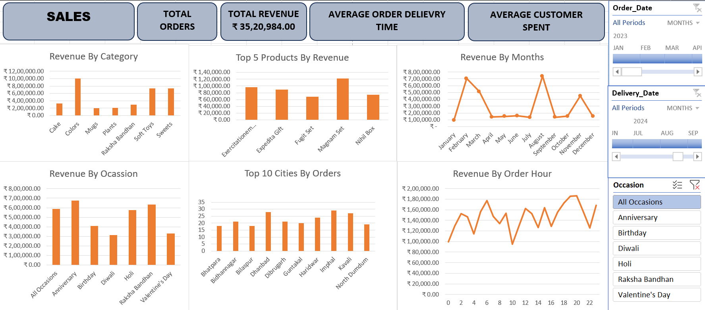
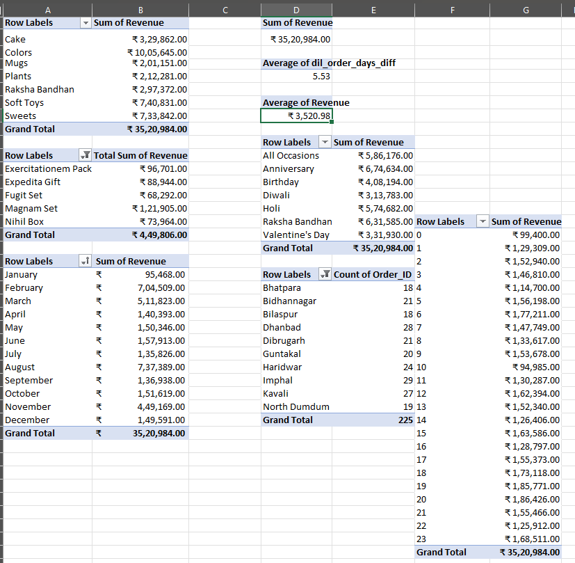

# Ferns and Petals Sales Analysis 📊🌸

## 📌 Project Overview

This project analyzes **Ferns and Petals (FNP)** sales data to uncover
insights about customer behavior, sales performance, and product
trends.
The analysis includes dashboards, pivot tables, and visualizations that
help identify top-performing products, revenue by category, customer
spending, and delivery trends.

------------------------------------------------------------------------

## 📂 Dataset

The dataset includes the following files:

-   `customers.csv` → Customer details
-   `orders.csv` → Order information (Order Date, Delivery Date, Order
    ID, etc.)
-   `products.csv` → Product details and categories

Additional files: - `Excel_Book.xlsx` → Contains pivot tables and
calculations - `DashBoard.png` → Snapshot of the dashboard -
`OutPut1.png` → Pivot table summary -
`Ferns and Petals Sales Analysis.pdf` → Full report with problem
statement and insights

------------------------------------------------------------------------

## 🎯 Key Business Questions Answered

1.  **Total Revenue** → What is the total revenue generated?
2.  **Average Order & Delivery Time** → How long does delivery usually
    take?
3.  **Monthly Sales Performance** → Which months have the highest
    sales?
4.  **Top Products by Revenue** → What are the top-performing products?
5.  **Customer Spending Analysis** → How much do customers spend on
    average?
6.  **Top 5 Products Performance** → Sales trends of the top 5
    products.
7.  **Top 10 Cities by Orders** → Which cities place the most orders?
8.  **Order Quantity vs Delivery Time** → Do larger orders take longer
    to deliver?
9.  **Revenue by Occasion** → Which occasions generate the most
    revenue?
10. **Product Popularity by Occasion** → Which products are popular for
    each occasion?

------------------------------------------------------------------------

## 📊 Dashboard & Visualizations

### 🔹 Revenue by Category

-   Highest revenue from **Colors, Soft Toys, and Sweets**

### 🔹 Top 5 Products by Revenue

-   **Magnum Set, Expedita Gift, Exercise Pack, Nihil Box, Fugit Set**

### 🔹 Revenue by Months

-   Peak sales in **August & September**

### 🔹 Revenue by Occasion

-   Top occasions: **Anniversary, Raksha Bandhan, Holi**

### 🔹 Top 10 Cities by Orders

-   **Imphal, Dhanbad, Kavali, Dibrugarh, Haridwar** lead in order
    count.

### 🔹 Revenue by Order Hour

-   Evening hours see higher order revenue trends.

------------------------------------------------------------------------

## 🛠 Tools & Techniques Used

-   **Excel** → Pivot tables, charts, and dashboards
-   **Python (Pandas, Matplotlib)** → Data preprocessing and
    visualization
-   **Power Query** → Data cleaning and transformation
-   **PDF Report** → Business insights and problem statement

------------------------------------------------------------------------

## 📷 Project Snapshots

### Dashboard View

### Pivot Table Analysis

------------------------------------------------------------------------

## 📌 Learning Outcomes

-   Data preprocessing and cleaning for business datasets
-   Dashboard creation with pivot tables and charts
-   Business insights extraction (customer behavior, product trends,
    sales performance)
-   Visualization and storytelling using real-world datasets

------------------------------------------------------------------------

## 📜 Author

Developed by **Vishal Singh**\
📧 For queries: \[Your Email/Contact Here\]
